# Rapport TP Ordonnancement

**Réalisé par Bastien Riado, Levi Cormier et Damien Tornambe dans le cadre du Master Miage 2025 à l'UFR IM²AG de l'UGA**

## 1. Modélisation

Dans cette première partie, nous souhaitons réaliser une modélisation de ce problème sous la forme d’un programme linéaire. 
Pour ce faire, nous allons commencer par définir les variables de décisions, les contraintes ainsi que le ou les objectifs.

---

### 1.1 Variables de décision

Nous avons identifié 3 types de variables de décisions : le moment où l'on choisit pour commencer une opération, 
l'état dans lequel se trouve une machine à un instant *t*, et la machine sur laquelle on affecte une opération.

Soit de manière plus formelle :
* Pour chaque opération `j` de chaque job `i`, l’instant $s_{ij}$ où elle débutera (en minutes).
* Pour chaque machine `k` et à chaque instant `t`, son état :
    * **Allumée mais inactive** (régime basse consommation).
    * **Opération en cours** (régime haute consommation).
    * **En cours d’allumage ou d’extinction** (avec un délai et une consommation spécifiques).
    * **Éteinte** (consommation nulle).
* Pour chaque opération `j` de chaque job `i`, une variable binaire $x_{ijk}$ qui vaut 1 si l'opération est affectée à la machine `k`, et 0 sinon.

### 1.2 Contraintes

Nous avons identifié 6 contraintes à respecter pour que la modélisation soit valide :

1.  **Précédence :** Une opération `j` d’une tâche `i` ne peut commencer qu’après la fin de l’opération `j-1`.
2.  **Ressource unique :** Une machine ne peut effectuer qu’une seule opération à la fois.
3.  **Disponibilité machine :** Il faut qu’une machine soit allumée pour pouvoir effectuer une opération sur cette dernière.
4.  **Délais de setup/teardown :** Le temps d’allumage d'une machine doit être écoulé avant de pouvoir démarrer une opération. De même, un délai d'extinction doit être respecté avant de pouvoir la rallumer.
5.  **Contrainte de Durée Maximale Machine :** L'ensemble du planning d'une machine, incluant tous les temps de préparation (setup), de traitement des opérations et d'extinction (teardown), doit se terminer avant la durée maximale de fonctionnement autorisée pour cette machine.
6.  **Totalité :** Toutes les tâches (jobs) doivent être effectuées.

### 1.3 Objectifs

Nous cherchons ici à minimiser simultanément 3 indicateurs de performance :

-   **$E$** = La consommation d’énergie totale (en kWh).
-   **$C_{max}$** = La durée totale de l’ensemble du planning (en minutes).
-   **$C_{moy}$** = Le temps moyen d'achèvement des tâches (en minutes).

Nous nous trouvons donc dans un cas d'optimisation multi-objectifs. 
Pour agréger ces indicateurs en une seule fonction, nous pouvons utiliser une **fonction objectif pondérée** :

$$
\min f = (\alpha \cdot E) + (\beta \cdot C_{max}) + (\gamma \cdot C_{moy})
$$

> Où $\alpha, \beta$ et $\gamma$ sont des coefficients de pondération positifs (avec $\alpha + \beta + \gamma = 1$) que l’on définit en fonction des priorités stratégiques de l'entreprise.

---

## 1.4 Évaluation d'une solution

> **Question :** Comment évaluer (c'est-à-dire donner une valeur à) une solution réalisable ? Comment évaluer une solution non réalisable ?

De manière assez logique, une solution au problème est **réalisable** si elle respecte l’ensemble des contraintes que nous a énoncées. Pour l'évaluer, il suffit de calculer la valeur de sa fonction objectif $f$.

Pour une solution **non réalisable**, l'objectif est de lui assigner un score qui soit toujours moins bon que n'importe quelle solution réalisable. L'approche classique est d'étendre la fonction objectif en y ajoutant des **pénalités** pour chaque contrainte violée.

On obtiendrait alors une fonction d'évaluation pénalisée $f'$ :

$$
f' = f + (\omega \cdot \sum \text{dépassements}) + (\xi \cdot \text{nb\_tâches\_non\_faites}) + (\delta \cdot \text{nb\_violations\_précédence})
$$

> Avec $\omega, \xi$ et $\delta$ des coefficients de pénalité très élevés, choisis pour garantir que toute solution non réalisable soit lourdement sanctionnée.

---

## Exemple d’instance sans solution réalisable

Considérons une instance simple pour illustrer un cas sans solution réalisable.

* **Machines :**
    * M1 : Durée d'exécution maximale = 10 minutes.
    * M2 : Durée d'exécution maximale = 10 minutes.
    * Toutes les machines ont un temps de setup/teardown de 1 minute.
* **Jobs :**
    * T1_Op1 : 6 minutes (sur M1 ou M2).
    * T1_Op2 : 5 minutes (sur M1).
    * T2_Op1 : 5 minutes (sur M2).
    * T2_Op2 : 6 minutes (sur M1 ou M2).

#### Visualisation du Problème

Le graphique ci-dessous compare la charge de travail totale requise avec la capacité totale des machines.

```mermaid
gantt
    title Comparaison Charge de Travail vs Capacité Totale
    dateFormat mm
    axisFormat %M
    
    section Charge Requise Totale
    Toutes Opérations: 0, 22
    
    section Capacité Disponible Totale
    M1 + M2: 0, 20
```

Il est dès lors très facile de voir qu’avec une telle instance, il nous sera impossible de respecter l’une de nos contraintes, à savoir de ne pas dépasser le temps d’exécution maximal de chaque machine.

En effet, peu importe l'arrangement, la somme des durées d'exécutions des tâches est de **22 minutes** (`6+5+5+6`), alors que l'on ne dispose que de **20 minutes** de capacité totale (`10+10`). Il n’existe donc aucune solution réalisable pour cette instance.