# Rapport TP ordonnancement

**Réalisé par Bastien Riado, Levi Cormier et Damien Tornambé dans le cadre du Master Miage 2025 à l'UFR IM²AG de l'UGA**

## 1. Modélisation

Dans cette première partie, nous souhaitons réaliser une modélisation de ce problème sous la forme d’un programme linéaire. 
Pour ce faire, nous allons commencer par définir les variables de décisions, les contraintes ainsi que le ou les objectifs.

---

### 1.1 Variables de décision

Nous avons identifié 3 types de variables de décisions : le moment où l'on choisit pour commencer une opération, 
l'état dans lequel se trouve une machine à un instant *t*, et la machine sur laquelle on affecte une opération.

Soit de manière plus formelle :
* Pour chaque opération `j` de chaque job `i`, l’instant $s_{ij}$ où elle débutera (en minutes).
* Pour chaque machine `k` et à chaque instant `t`, son état :
    * **Allumée mais inactive** (régime basse consommation).
    * **Opération en cours** (régime haute consommation).
    * **En cours d’allumage ou d’extinction** (avec un délai et une consommation spécifiques).
    * **Éteinte** (consommation nulle).
* Pour chaque opération `j` de chaque job `i`, une variable binaire $x_{ijk}$ qui vaut 1 si l'opération est affectée à la machine `k`, et 0 sinon.

### 1.2 Contraintes

Nous avons identifié 6 contraintes à respecter pour que la modélisation soit valide :

1.  **Précédence :** Une opération `j` d’une tâche `i` ne peut commencer qu’après la fin de l’opération `j-1`.
2.  **Ressource unique :** Une machine ne peut effectuer qu’une seule opération à la fois.
3.  **Disponibilité machine :** Il faut qu’une machine soit allumée pour pouvoir effectuer une opération sur cette dernière.
4.  **Délais de setup/teardown :** Le temps d’allumage d'une machine doit être écoulé avant de pouvoir démarrer une opération. De même, un délai d'extinction doit être respecté avant de pouvoir la rallumer.
5.  **Contrainte de Durée Maximale Machine :** L'ensemble du planning d'une machine, incluant tous les temps de préparation (setup), de traitement des opérations et d'extinction (teardown), doit se terminer avant la durée maximale de fonctionnement autorisée pour cette machine.
6.  **Totalité :** Toutes les tâches (jobs) doivent être effectuées.

### 1.3 Objectifs

Nous cherchons ici à minimiser simultanément 3 indicateurs de performance :

-   **$E$** = La consommation d’énergie totale (en kWh).
-   **$C_{max}$** = La durée totale de l’ensemble du planning (en minutes).
-   **$C_{moy}$** = Le temps moyen d'achèvement des tâches (en minutes).

Nous nous trouvons donc dans un cas d'optimisation multi-objectifs. 
Pour agréger ces indicateurs en une seule fonction, nous pouvons utiliser une **fonction objectif pondérée** :

$$
\min f = (\alpha \cdot E) + (\beta \cdot C_{max}) + (\gamma \cdot C_{moy})
$$

> Où $\alpha, \beta$ et $\gamma$ sont des coefficients de pondération positifs (avec $\alpha + \beta + \gamma = 1$) que l’on définit en fonction des priorités stratégiques de l'entreprise.

---

### 1.4 Évaluation d'une solution

> **Question :** Comment évaluer (c'est-à-dire donner une valeur à) une solution réalisable ? Comment évaluer une solution non réalisable ?

De manière assez logique, une solution au problème est **réalisable** si elle respecte l’ensemble des contraintes que nous a énoncées. Pour l'évaluer, il suffit de calculer la valeur de sa fonction objectif $f$.

Pour une solution **non réalisable**, l'objectif est de lui assigner un score qui soit toujours moins bon que n'importe quelle solution réalisable. L'approche classique est d'étendre la fonction objectif en y ajoutant des **pénalités** pour chaque contrainte violée.

On obtiendrait alors une fonction d'évaluation pénalisée $f'$ :

$$
\min f' = f + (\omega \cdot \sum \text{dépassements}) + (\xi \cdot \text{nbtâchesnonfaites}) + (\delta \cdot \text{nbviolationsprécédence})
$$

> Avec $\omega, \xi$ et $\delta$ des coefficients de pénalité très élevés, choisis pour garantir que toute solution non réalisable soit lourdement sanctionnée.

---

### 1.5 Exemple d’instance sans solution réalisable

Considérons une instance simple pour illustrer un cas sans solution réalisable.

* **Machines :**
    * M1 : Durée d'exécution maximale = 10 minutes.
    * M2 : Durée d'exécution maximale = 10 minutes.
    * Toutes les machines ont un temps de setup/teardown de 1 minute.
* **Jobs :**
    * T1_Op1 : 6 minutes (sur M1 ou M2).
    * T1_Op2 : 5 minutes (sur M1).
    * T2_Op1 : 5 minutes (sur M2).
    * T2_Op2 : 6 minutes (sur M1 ou M2).

#### Visualisation du Problème

Le graphique ci-dessous compare la charge de travail totale requise avec la capacité totale des machines.

Il est dès lors très facile de voir qu’avec une telle instance, il nous sera impossible de respecter l’une de nos contraintes, à savoir de ne pas dépasser le temps d’exécution maximal de chaque machine.

En effet, peu importe l'arrangement, la somme des durées d'exécutions des tâches est de **22 minutes** (`6+5+5+6`), alors que l'on ne dispose que de **20 minutes** de capacité totale (`10+10`). Il n’existe donc aucune solution réalisable pour cette instance.

### 1.6 Implémentation des classes

Le package `instance` et le module `solution` ont été complétés en fonction des réponses ci-dessus.

## 2. Premières heuristiques

> **Note :** Les visuels qui suivront, à la fois dans cette partie 2 mais également dans la partie 3, se baseront sur l'exemple simple suivant : 2 machines (M1, M2) et 2 jobs (J1, J2), chacun avec 2 opérations.
> * **Job 1 :** Op1A → Op1B
> * **Job 2 :** Op2A → Op2B

---

### 2.1 Heuristique gloutonne déterministe

#### Choix de l'heuristique

Nous avons choisi un critère glouton très commun en ordonnancement : celui de la **fin au plus tôt**.

#### Principe de l'algorithme : Sélection par ID et meilleure machine

L'algorithme construit la solution étape par étape de la manière suivante :

1.  On part d'un planning vide.
2.  Tant qu'il reste des opérations à planifier, on récupère la liste de toutes les **opérations "disponibles"** (dont les prédécesseurs sont terminés).
3.  **Sélection déterministe :** Pour garantir que le résultat soit toujours le même, on trie cette liste par l'identifiant des opérations (`operation_id`) et on sélectionne toujours la première.
4.  Pour l'opération sélectionnée, on évalue toutes les machines capables de l'exécuter. Pour chaque machine, on calcule l'heure de fin potentielle de l'opération.
5.  **Choix glouton :** On sélectionne la machine qui permet d'obtenir **l'heure de fin la plus précoce** pour cette opération spécifique.
6.  On planifie l'opération sur cette "meilleure" machine et on recommence le processus.

> **Justification du caractère glouton**
>
> C'est un algorithme glouton car il décide de l'ordonnancement des tâches de manière **locale**. 
> Il optimise l'étape présente sans aucune garantie sur la qualité globale de la solution finale.

#### Complexité
Soit **N** le nombre total d'opérations et **M** le nombre total de machines.

- La boucle principale s'exécute **N** fois, une fois pour chaque opération.
- À chaque itération de la boucle :
    - La collecte des opérations disponibles prend au plus `O(N)`.
    - La sélection de l'opération avec le plus petit ID prend `O(N)`.
    - La recherche de la meilleure machine nécessite de tester jusqu'à `M` machines, donc `O(M)`.
- Le coût d'une itération est donc `O(N + M)`.

La complexité totale de l'heuristique gloutonne est de **`O(N * (N + M))`**, ce qui se simplifie en **`O(N² + NM)`**.

#### Visualisation du planning généré par l'heuristique gloutonne déterministe

```mermaid
gantt
    title Heuristique gloutonne (déterministe)
    dateFormat HH:mm
    axisFormat %H:%M
    
    section Machine 1
    Op1A (J1) :j1, 00:00, 3h
    Op2A (J2) :j2, 03:00, 4h
    
    section Machine 2
    Op1B (J1) :j1, 00:00, 2h
    Op2B (J2) :j2, 04:00, 3h
```

---

### 2.2 Heuristique non-déterministe

#### Choix de l'heuristique

Nous décidons de reprendre l'algorithme glouton de la partie 2.1, et d'introduire un élément **aléatoire** dans la sélection des opérations à exécuter.

#### Principe de l'algorithme : Sélection aléatoire et meilleure machine

L'algorithme est très similaire au précédent, à l'exception d'une seule étape cruciale :

1.  On part d'un planning vide.
2.  Tant qu'il reste des opérations à planifier, on récupère la liste de toutes les opérations "disponibles".
3.  **Sélection non-déterministe :** Au lieu de trier la liste, on en choisit une opération **au hasard** avec `random.choice()`. C'est cette étape qui garantit qu'une nouvelle exécution produira un résultat différent.
4.  Pour l'opération choisie aléatoirement, on applique la même logique gloutonne que précédemment : on trouve la machine qui lui assure la fin au plus tôt (ECT).
5.  On planifie l'opération sur cette meilleure machine et on recommence.

#### Complexité
La structure de l'algorithme reste la même que celle de la version déterministe.

- La boucle principale s'exécute **N** fois.
- À chaque itération de la boucle :
    - La collecte des opérations disponibles prend `O(N)`.
    - Le choix d'une opération au hasard dans la liste prend `O(1)`.
    - La recherche de la meilleure machine prend `O(M)`.
- Le coût d'une itération est donc également `O(N + M)`.

La complexité totale de l'heuristique non-déterministe est donc identique à celle de la version déterministe : **`O(N * (N + M))`** ou **`O(N² + NM)`**.

#### Visualisation du planning généré par l'heuristique non-déterministe

```mermaid
gantt
    title Heuristique non-déterministe (représente 1 résultat possible)
    dateFormat HH:mm
    axisFormat %H:%M
    
    section Machine 1
    Op2A (J2) :j2, 00:00, 4h
    Op1B (J1) :j1, 04:00, 2h

    section Machine 2
    Op1A (J1) :j1, 00:00, 3h
    Op2B (J2) :j2, 04:00, 3h
```

---

## 3. Recherche locale

### 3.1 Échange d'opérations sur la même machine

**Description du mouvement :**
On choisit une machine, puis deux opérations adjacentes dans sa file d'attente, et on les inverse. Par exemple, si une machine faisait `OpA -> OpB -> OpC`, un voisin serait la solution où la machine fait `OpB -> OpA -> OpC`. 
On ne peut faire cet échange que si les contraintes de précédence sont toujours respectées (par exemple, si OpA n'est pas un prédécesseur direct de OpB dans le même job).

**Analyse :**
* **Taille :** Si on a $N$ opérations au total, il y a environ $N$ paires adjacentes. La taille du voisinage est donc de l'ordre de $O(N)$.
* **Polynomial :** Comme la taille du voisinage est linéaire, il est polynomiale.
* **Connexité :** En effectuant suffisamment d'échanges, on peut obtenir n'importe quelle permutation des opérations sur chaque machine. Ce voisinage permet donc d'explorer tout l'espace des séquencements possibles pour une affectation de machines donnée.

---

### 3.2 Changement de machine pour une opération

**Description du mouvement :**
On choisit une seule opération dans tout le planning et on la déplace sur une autre machine qui est capable de l'exécuter.

**Analyse :**
* **Taille :** Pour chaque opération (il y en a $N$), on peut la déplacer sur $C-1$ autres machines (où $C$ est le nombre de machines candidates pour cette opération). La taille est de l'ordre de $O(N \times M)$, où $M$ est le nombre de machines.
* **Polynomial :** Oui car $O(N \times M)$ est polynomial.
* **Connexité :** En changeant l'affectation de chaque opération une par une, on peut potentiellement atteindre n'importe quelle configuration d'assignation des opérations aux machines.

---

### 3.3 Illustration de la Recherche Locale via l'échange d'opérations sur la même machine

La recherche locale part d'une solution (par exemple, celle de l'heuristique non-déterministe) et l'améliore. 
Ici, nous illustrons un mouvement d'échange d'opération sur la même machine : on échange Op1B et Op2A sur la Machine 1, car c'est possible et cela améliore la solution.

#### AVANT (Solution Initiale)

```mermaid
gantt
    title AVANT recherche locale
    dateFormat HH:mm
    axisFormat %H:%M
    
    section Machine 1
    Op2A (J2) :j2, 00:00, 4h
    Op1B (J1) :j1, 04:00, 2h

    section Machine 2
    Op1A (J1) :j1, 00:00, 3h
    Op2B (J2) :j2, 04:00, 3h
```

#### APRÈS le mouvement d'échange d'opération

```mermaid
gantt
    title APRÈS recherche locale (Sur un échange d'opérations)
    dateFormat HH:mm
    axisFormat %H:%M
    
    section Machine 1
    Op1B (J1) :j1, 03:00, 2h
    Op2A (J2) :j2, 05:00, 4h
    
    section Machine 2
    Op1A (J1) :j1, 00:00, 3h
    Op2B (J2) :j2, 04:00, 3h
```

---

