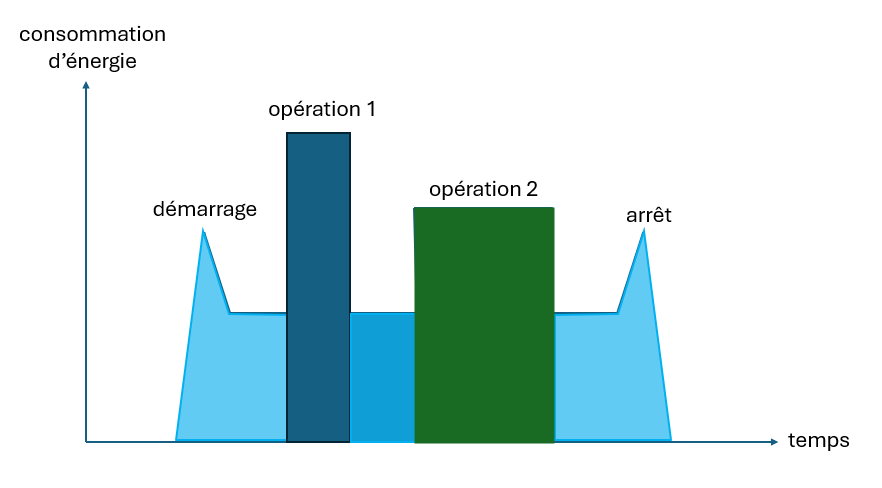

# TP ordonnancement de tâches

Dans une usine, on doit effectuer des tâches (jobs) comportant chacune plusieurs opérations.
Ces opérations peuvent être effectuées sur un ensemble de machines (spécifique à chaque opération) et leur durée et la quantité d'énergie nécessaire dépend de la machine choisie pour effectuer l'opération.
On doit effectuer les opérations d'une même tâche l'une après l'autre : l'opération $i$ de la tâche ne peut commencer que si l'opération $i+1$ est terminée.
Les machines peuvent être allumées ou éteintes.
Lorsqu'une machine est allumée, elle a besoin d'une quantité importante d'énergie et de temps avant d'être opérationnelle, de même, lorsqu'on l'éteint.
Si elle reste allumée, mais n'effectue aucune opération, sa consommation est basse.
Lorsqu'elle effectue une opération, sa consommation est haute.

La consommation d'électricité d'une machine entre le moment où elle est allumée et le moment où elle est éteinte ressemble donc à :


On peut allumer et éteindre une même machine plusieurs fois durant son planning si cela permet de diminuer sa consommation d'énergie.
Si ce n'est pas le cas, elle sera au moins allumée en début de planning et éteinte en fin de planning.

L'entreprise souhaite utiliser le moins d'énergie possible, mais la durée d'exécution des tâches est aussi importante et elle peut être amenée à utiliser plus d'énergie pour baisser la durée totale du planning ou la durée moyenne pour effectuer une tâche.
En effet, le planning de chaque machine ne peut pas dépasser une durée maximale fixée par l'entreprise et toutes les tâches doivent être effectuées.

L'objectif du TP est de proposer des solutions d'optimisation à l'entreprise pour obtenir pour chaque ensemble de tâches des plannings précisant pour chaque opération la machine sur laquelle elle est effectuée, son heure de départ, ainsi que les heures de démarrage et d'arrêt des différentes machines.

Chaque groupe devra rendre :
- Un compte rendu (format markdown ou pdf) répondant aux questions du TP
- Le code complété (zip ou lien github)


## Modélisation

Le but des questions suivante est de proposer un modèle du problème. 
1)	Quelles sont les variables de décision ? Quelles sont les contraintes ? Quels sont les objectifs ?
2)  Proposez une fonction objectif qui agrège les différents objectifs de l'entreprise.
3)	Comment évaluer (c'est-à_dire donner une valeur à) une solution réalisable ? Comment évaluer une solution non réalisable ?
4)	Proposer une instance pour laquelle il n’existe pas de solution réalisable et expliquer pourquoi aucune solution n'est réalisable pour cette instance.
5) Compléter les classes du package ```instance``` et du module ```solution``` en fonction de vos réponses.
Certains tests sont implémentés dans le package ```tests``` pour vous aidez à implémenter ces classes, mais vous devez implémenter au minimum les tests proposés dans les modules ```test_machine```, ```test_job``` et ```test_solution```.


## Premières heuristiques

Les instances proposées par l'entreprise ont au moins une solution réalisable.
Le but est de disposer de deux méthodes, une déterministe et une non déterministe qui construisent une première solution, réalisable ou non. Si les solutions construites peuvent être non réalisables, il vous est conseillé de limiter le nombre de contraintes pouvant être violées par vos heuristiques.

Toutes les heuristiques du TP hériteront de la classe ```optim.heuristics.Heuristic``` et doivent en implémenter les méthodes.

1) Proposer un algorithme glouton déterministe qui construit une solution. Préciser en quoi cet algorithme est glouton.
Il sera implémenté dans la classe ```Greedy``` du module ```optim.constructive```.
2) Proposer un algorithme non-déterministe qui construit une solution différente pour la même instance à chaque appel.
Il sera implémenté dans la classe ```NonDeterminist``` du module ```optim.constructive```.
3) Pour chacun des algorithmes, indiquer sa complexité.

## Recherche locale

1) Proposer deux voisinages de solutions. Dans chaque cas, vous indiquerez (en le justifiant)
- la taille du voisinage, 
- si le voisinage est de taille polynomiale par rapport à la taille de l'instance
- si on peut atteindre toutes les solutions de l'espace de solution en l'utilisant
2) Implémenter ces voisinages dans le module ```optim.neighborhoods```.
3) Implémenter dans le module ```optim.local_search``` deux algorithmes de recherche locale.
   Dans les deux cas, la solution initiale sera obtenue par la classe ```NonDeterminist```.
   - Le premier utilisera un seul voisinage et la première solution améliorante pour chaque exploration de voisinage.
   - Le second utilisera les deux voisinages et la meilleure solution de chaque voisinage. Au besoin, on pourra ajouter un critère d'arrêt supplémentaire.
4) Comparer ces deux algorithmes et l'algorithme glouton en termes de temps de calcul et de qualité des solutions obtenues.
   Les algorithmes non-déterministes seront exécutés le même nombre de fois chacun et on gardera la meilleure solution.
   Pour cette question, vous devez implémenter votre propre script et vous pouvez utiliser les instances présentes dans ```data```.
